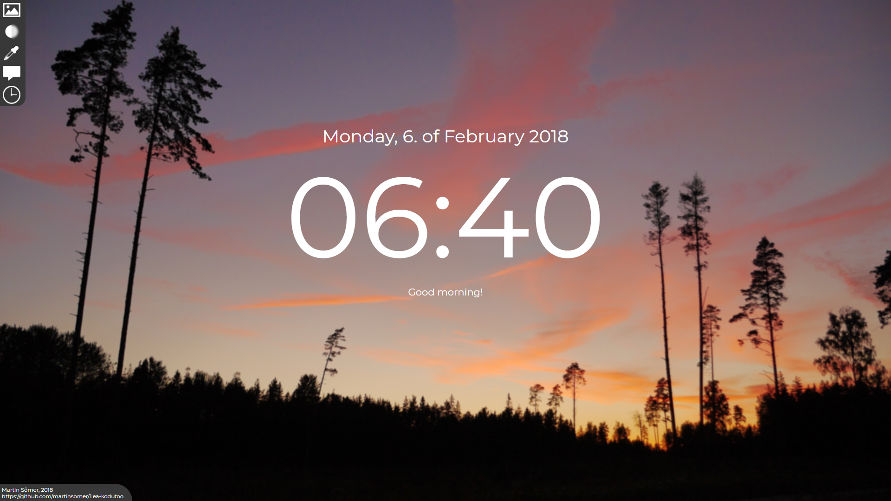
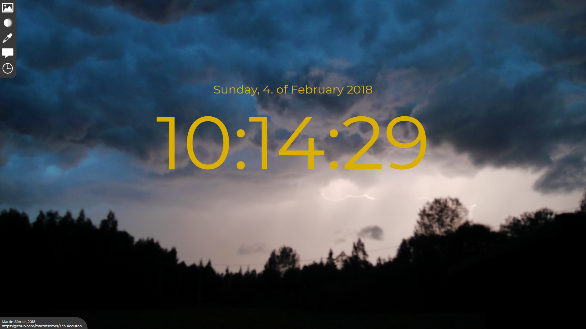

## HTML + CSS + JS + (JQuery) of a page for displaying a desk clock, with some additional features. ##  
#### Martin Sõmer, 2018 ####  

## FEATURES: ##  
*Clock with Date, Day, Month, and Year
*Change background  
*Change text color  
*Add a custom message  
*Show/hide seconds  

### HOW TO USE: ###  
*Use the controls in top-left to set the different options:  
    *"Change background" - Paste the link to an image into the text box and klick "OK"  
    *"Change text color" - Enter a hex code (i.e. "#c11218") or color name (i.e. "green") and klick "OK"  
    *"Add a message" - Enter text and klick "OK"  
    *"Toggle seconds" - Check or un-check the tick box and click "OK"  

## SCREENSHOTS: ##   
  
  
  
  